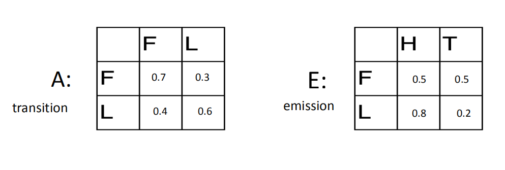

# HMM-Viterbi
ML problem

## Problem description:
Implement the HMM Viterbi algorithm on the cheating dealer problem (see the note). Your 
output should be the log value of the probability (i.e. the probability of the most likely state 
path). It is NOT required to output the optimal state path but you should know how to modify 
your program to do that. That means, you can also output which flips are generated by a loaded 
coin. 

You can hardcode the following HMM in your program. Two states: L and F (loaded and fair 
coin, respective). Each coin can emit either head (H) or tail (T). 
Initial probability: 0.5 for L and 0.5 for F.

The test file can be found in the same folder, test1.txt. When we test your program, we 
will change the inputs but they will always have the same input format. The test file contains 
one line that is a string of H and T.

